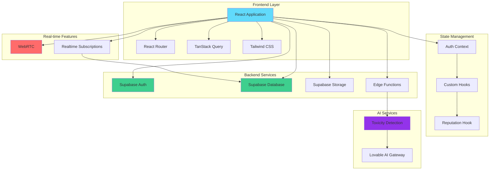
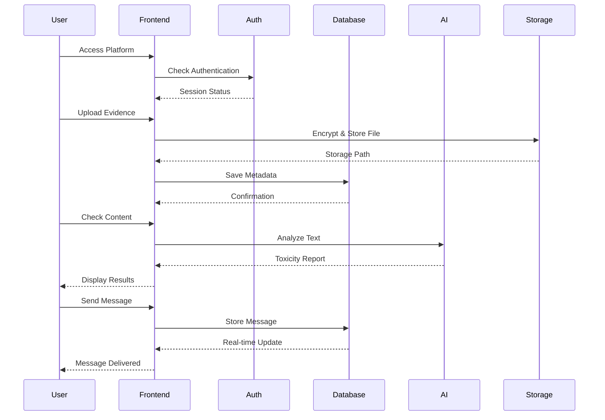
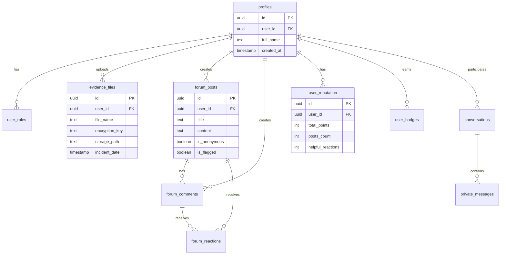

# 🛡️ HERA SafeSpace

<div align="center">


**Empowering women and girls across Africa with AI-powered protection, survivor support, and digital literacy education**

[](https://github.com)
[](LICENSE)
[](https://reactjs.org/)
[](https://www.typescriptlang.org/)
[](https://supabase.com/)
[](https://ai.google.dev/)
[](https://github.com)
[](https://sdgs.un.org/goals/goal5)
[](https://sdgs.un.org/goals/goal16)

[Features](#-features) • [Screenshots](#-app-screenshots) • [Why HERA](#-why-hera-safespace) • [Getting Started](#-getting-started) • [Contributing](#-contributing)

**🏷️ Tags:** `#GBV` `#WomenSafety` `#AI` `#DigitalSafety` `#Africa` `#Kenya` `#SurvivorSupport` `#TechForGood` `#SocialImpact` `#Hackathon` `#SDG5` `#SDG16` `#DigitalLiteracy` `#CyberSafety` `#EmergencyResponse`

</div>

---

## 📖 Table of Contents

- [Overview](#-overview)
- [App Screenshots](#-app-screenshots)
- [Why HERA SafeSpace](#-why-hera-safespace)
- [Features](#-features)
- [Architecture](#-architecture)
- [Getting Started](#-getting-started)
- [Project Structure](#-project-structure)
- [Core Technologies](#-core-technologies)
- [Security & Privacy](#-security--privacy)
- [Deployment](#-deployment)
- [Contributing](#-contributing)
- [License](#-license)
- [Support Resources](#-support-resources)
- [Team Members](#-team-members---group-6)
- [SDG Alignment](#-sdg-alignment)

---

## 🌟 Overview

**HERA SafeSpace** is a comprehensive digital safety platform specifically designed for women and girls across Africa, with special focus on communities in Kenya and surrounding regions. The platform combines cutting-edge AI technology with culturally-sensitive support systems to create a safe space for learning, reporting, and community support.

### 🌍 The Problem We are Solving

**Gender-Based Violence (GBV) Statistics in Africa:**
- 1 in 3 women worldwide experience physical or sexual violence
- In Kenya, 45% of women aged 15-49 have experienced physical violence
- Only 40% of women who experience violence seek help
- Digital harassment and cyberbullying affect 73% of women online

HERA SafeSpace addresses these critical challenges by providing a safe, accessible, and culturally-sensitive digital platform.

### 🎯 Mission

To provide accessible, secure, and culturally-aware digital tools that empower women and girls to:
- **Detect** harmful content and online threats using AI
- **Document** incidents securely with military-grade encryption
- **Learn** digital safety skills through interactive lessons
- **Connect** with support networks and verified resources
- **Support** each other through anonymous community forums

---

## 📸 App Screenshots

### 🏠 Homepage - Your Digital Safety Companion
<div align="center">

</div>

The homepage provides a welcoming overview of the platform with:
- Clear call-to-action buttons for quick access to features
- Statistics showcasing AI-powered detection, 24/7 support, and confidentiality
- Three pillars of protection: AI Detector, Support Portal, and Literacy Hub
- Testimonials from real users across Africa
- Emergency contact information for immediate help

### 🤖 AI Digital Violence Detector
<div align="center">

</div>

Real-time AI protection featuring:
- Instant text analysis for toxicity, threats, and harassment
- Smart alerts before sending or reading unsafe messages
- Safe rewrite suggestions for potentially harmful content
- Detection of cyberbullying, threats, hate speech, and more
- Upcoming browser extension for seamless protection across platforms

### 💜 Survivor Support Portal
<div align="center">

</div>

Comprehensive support resources including:
- Military-grade encrypted evidence storage
- Verified emergency contacts for Kenya and Africa
- Mental health support resources
- Legal aid and guidance information
- Culturally-sensitive support designed for African communities

### 💬 Community Forum
<div align="center">

</div>

Safe community space with:
- Anonymous posting options for privacy
- Supportive peer-to-peer connections
- AI-moderated content for safety
- Reaction and engagement system

### 🧭 Organized Navigation
<div align="center">

</div>

Clean, intuitive navigation featuring:
- **Primary Navigation**: Quick access to Home, Learn, AI Detector, and Support
- **Community Dropdown**: Easy access to Forum and Private Messages
- **Account Menu**: Profile, Evidence Locker, and Settings in one place
- Streamlined interface that reduces overwhelm for users

### 📱 Mobile-Friendly Navigation
<div align="center">

</div>

Mobile-optimized experience with:
- Organized sections (Main, Community, Account)
- Clear visual hierarchy
- Easy-to-tap buttons
- Responsive design for all screen sizes

---

## 💪 Why HERA SafeSpace?

### Unlike Other Platforms, HERA Offers:

| Feature | HERA SafeSpace | Other Apps |
|---------|----------------|------------|
| 🌍 **Africa-Focused** | Built specifically for African women with local resources | Generic global approach |
| 🤖 **AI-Powered Detection** | Real-time toxicity analysis with smart alerts | Basic or no AI protection |
| 🔒 **Military-Grade Encryption** | AES-256 encryption for all evidence | Standard or minimal encryption |
| 👤 **Anonymous Support** | Full anonymity options throughout the platform | Limited privacy options |
| 📚 **Interactive Learning** | Gamified lessons with badges and progress tracking | Static resources or none |
| 🚨 **SOS Emergency Feature** | Quick-exit with decoy screen for dangerous situations | No emergency features |
| 🌐 **Offline Resources** | Emergency contacts and guides available offline | Online-only access |
| 💜 **Survivor-Centered Design** | Designed with and for survivors | Designed by developers alone |
| 🤝 **Community Support** | Anonymous forum with AI moderation | No community features |
| 📞 **Local Emergency Contacts** | Verified Kenya and Africa emergency numbers | International numbers only |

### Key Benefits

1. **Privacy First**: Your data is encrypted and never shared without consent
2. **Culturally Aware**: Designed with understanding of African contexts and communities
3. **Always Accessible**: Emergency resources available 24/7
4. **Empowering**: Learn to protect yourself through interactive lessons
5. **Community Driven**: Connect with others who understand your experiences
6. **Evidence Documentation**: Securely store evidence for legal or support purposes
7. **Real-Time Protection**: AI monitors and warns about threatening content
8. **Quick Exit**: SOS button provides instant escape with decoy calculator screen

---

## ✨ Features

### 🤖 AI-Powered Detection
- **Real-time toxicity analysis** using advanced AI models
- **Content categorization** for different types of harmful content
- **Severity assessment** with confidence scores
- **Detailed explanations** to help users understand threats

### 🖼️ AI-Moderated Image Sharing
- **Image upload support** in forum posts and private messages
- **Automatic AI content moderation** for all uploaded images
- **Safety filtering** to block inappropriate content
- **Progress tracking** for upload status

### 🔒 Evidence Locker
- **Military-grade AES encryption** for file security
- **Secure upload system** with metadata tracking
- **Incident date logging** for documentation
- **Privacy-first design** with user-only access

### 📚 Digital Literacy Hub
- **9 Comprehensive Lessons** covering all aspects of digital safety:
  - Recognizing Digital Violence
  - Protecting Your Digital Identity  
  - Spotting Impersonation & Catfishing
  - Social Media Security
  - Responding to Online Threats
  - Safe Online Communication
  - Device Security Essentials
  - Online Reputation Management
  - Supporting Others Online
- **Interactive Learning Experience** with slide-based content navigation
- **Knowledge Quizzes** after each lesson to reinforce learning
- **Progress Tracking** with visual indicators
- **Quick Tips Tab** with daily safety checklist
- **Resources Tab** with FAQ and external help links
- **Achievement Badges System**:
  - 🌱 First Steps (Complete first lesson)
  - 📚 Safety Scholar (Complete 3 lessons)
  - 🛡️ Digital Guardian (Complete 6 lessons)
  - 🏆 Safety Expert (Complete all 9 lessons)

### 💬 Community Forum
- **Anonymous posting** option for privacy
- **Image sharing** with AI moderation
- **Reputation system** with points and badges
- **Reaction system** for supportive engagement
- **Content moderation** tools
- **Flag system** for inappropriate content

### 📨 Private Messaging
- **End-to-end encrypted** conversations
- **Image sharing** with AI content moderation
- **Anonymous chat** capabilities
- **Real-time messaging** with WebSocket support
- **Video/Voice calls** using WebRTC
- **Read receipts** and status indicators

### 🚨 Quick Exit (SOS Mode)
- **Emergency exit button** (hold for 2 seconds)
- **Decoy calculator screen** for safety
- **Triple-tap exit** from decoy mode
- **Quick escape** in dangerous situations

### ⚙️ User Settings
- **Profile management** with display name customization
- **Password change** functionality
- **Notification preferences** (email, forum, messages)
- **Privacy controls** (anonymous posting, online status, message permissions)
- **Account management** options

### 👥 Admin Dashboard
- **Interactive analytics** with charts and graphs
- **User management** with role assignment
- **Evidence monitoring** (metadata only)
- **Content moderation** for flagged posts
- **Toxicity trends** visualization
- **Activity tracking** over time
- **Secure admin-only access** via `/admin` URL

### 📊 Reporting Dashboard (Admin)
- **Platform activity charts** showing posts, evidence, and user trends
- **Content moderation pie charts** by category
- **Monthly trends** for flagged vs resolved content
- **Evidence upload** activity visualization
- **Real-time statistics** updates

---

## 🏗️ Architecture



### 🔄 Data Flow



---

## 🚀 Getting Started

### Prerequisites

Before you begin, ensure you have the following installed:
- **Node.js** (v18 or higher)
- **npm** or **yarn** package manager
- **Git** for version control

### Installation

1. **Clone the repository**
   ```bash
   git clone https://github.com/lewiii254/hera-safehaven.git
   cd hera-safehaven
   ```

2. **Install dependencies**
   ```bash
   npm install
   # or
   yarn install
   ```

3. **Set up environment variables**
   
   Copy the example environment file and configure your Supabase credentials:
   ```bash
   cp .env.example .env
   ```
   
   Then edit `.env` with your Supabase credentials:
   ```env
   VITE_SUPABASE_URL=https://your-project-id.supabase.co
   VITE_SUPABASE_ANON_KEY=your-anon-key-here
   ```
   
   > **Note for Lovable deployments:** These values are automatically injected when you connect Supabase through the Lovable dashboard. If authentication isn't working, try reconnecting your Supabase project in the Lovable settings.

4. **Start the development server**
   ```bash
   npm run dev
   # or
   yarn dev
   ```

5. **Open your browser**
   
   Navigate to `http://localhost:5173` to see the application running.

### 🔑 First Admin Setup

1. Create a regular account through `/auth`
2. Access your Supabase dashboard
3. Insert admin role in `user_roles` table:
   ```sql
   INSERT INTO user_roles (user_id, role)
   VALUES ('your-user-id', 'admin');
   ```
4. Access admin dashboard at `/admin`

---

## 📁 Project Structure

```
hera-safespace/
├── 📂 public/              # Static assets
├── 📂 src/
│   ├── 📂 components/      # Reusable UI components
│   │   ├── ui/            # shadcn/ui components
│   │   ├── Navigation.tsx # Main navigation
│   │   ├── SOSButton.tsx  # Emergency exit button
│   │   ├── DecoyScreen.tsx # Safety decoy screen
│   │   ├── ImageUpload.tsx # AI-moderated image upload
│   │   └── VideoCallInterface.tsx # WebRTC component
│   ├── 📂 hooks/          # Custom React hooks
│   │   ├── useAuth.tsx    # Authentication hook
│   │   └── useReputation.tsx # Reputation system
│   ├── 📂 integrations/   # Third-party integrations
│   │   └── supabase/      # Supabase client & types
│   ├── 📂 pages/          # Page components
│   │   ├── Index.tsx      # Landing page
│   │   ├── Auth.tsx       # Login/Signup
│   │   ├── Learn.tsx      # Learning hub
│   │   ├── Detect.tsx     # AI detection
│   │   ├── Support.tsx    # Support portal
│   │   ├── EvidenceLocker.tsx # Evidence management
│   │   ├── CommunityForum.tsx # Forum with image sharing
│   │   ├── Messages.tsx   # Private messaging
│   │   ├── Settings.tsx   # User settings & preferences
│   │   └── AdminDashboard.tsx # Admin panel with analytics
│   ├── 📂 lib/            # Utility functions
│   ├── App.tsx            # Root component
│   ├── main.tsx           # Entry point
│   └── index.css          # Global styles
├── 📂 supabase/
│   ├── 📂 functions/      # Edge functions
│   │   └── detect-toxicity/ # AI detection service
│   └── 📂 migrations/     # Database migrations
├── package.json
├── vite.config.ts
├── tailwind.config.ts
└── README.md
```

---

## 🛠️ Core Technologies

### Frontend Stack
- **⚛️ React 18.3.1** - UI library
- **📘 TypeScript** - Type safety
- **🎨 Tailwind CSS** - Utility-first styling
- **🧩 shadcn/ui** - Component library
- **🔄 TanStack Query** - Server state management
- **🧭 React Router** - Client-side routing

### Backend & Infrastructure
- **🔐 Supabase** - Backend-as-a-Service
  - PostgreSQL database
  - Authentication
  - Row Level Security (RLS)
  - Real-time subscriptions
  - File storage
  - Edge functions

### AI & Real-time
- **🤖 Lovable AI Gateway** - AI model access
  - Google Gemini 2.5 Flash for toxicity detection
- **📹 WebRTC** - Video/voice calling
- **⚡ WebSocket** - Real-time messaging

### Development Tools
- **⚡ Vite** - Build tool & dev server
- **🔍 ESLint** - Code linting
- **💅 Prettier** - Code formatting

---

## 🔐 Security & Privacy

### Encryption
- **AES-256** encryption for evidence files
- **Unique encryption keys** per file
- **Secure key storage** in database
- **Client-side encryption** before upload

### Authentication
- **JWT-based authentication** via Supabase Auth
- **Email verification** support
- **Password requirements** enforced
- **Session management** with auto-refresh

### Row Level Security (RLS)
All database tables have RLS policies:
- Users can only access their own data
- Anonymous posting support
- Admin-level access controls
- Evidence files are user-isolated

### Data Privacy
- **No personal data collection** without consent
- **Anonymous participation** option throughout
- **Encrypted communications**
- **GDPR compliance** considerations
- **African data sovereignty** awareness

---

## 📊 Database Schema



---

## 🚀 Deployment

### Deploying with Lovable

1. **Commit your changes**
   ```bash
   git add .
   git commit -m "Ready for deployment"
   git push
   ```

2. **Deploy via Lovable Dashboard**
   - Click "Publish" button in Lovable editor
   - Frontend changes: Click "Update" in publish dialog
   - Backend changes: Deploy automatically

3. **Custom Domain** (Optional)
   - Navigate to Project > Settings > Domains
   - Click "Connect Domain"
   - Follow DNS configuration steps

### Manual Deployment Options

#### Frontend (Vercel)
```bash
npm run build
vercel --prod
```

#### Frontend (Netlify)
```bash
npm run build
netlify deploy --prod --dir=dist
```

#### Edge Functions
Edge functions are deployed automatically with Lovable Cloud.

---

## 🤝 Contributing

We welcome contributions from the community! Here's how you can help:

### Development Workflow

1. **Fork the repository**
2. **Create a feature branch**
   ```bash
   git checkout -b feature/amazing-feature
   ```
3. **Make your changes**
4. **Commit with clear messages**
   ```bash
   git commit -m "Add: Amazing feature description"
   ```
5. **Push to your fork**
   ```bash
   git push origin feature/amazing-feature
   ```
6. **Open a Pull Request**

### Contribution Guidelines

- ✅ Follow existing code style
- ✅ Write clear commit messages
- ✅ Add comments for complex logic
- ✅ Test your changes thoroughly
- ✅ Update documentation as needed
- ✅ Respect cultural sensitivities
- ✅ Maintain privacy-first approach

### Code of Conduct

- Be respectful and inclusive
- Focus on constructive feedback
- Support survivors and vulnerable users
- Maintain confidentiality
- Report security issues responsibly

---

## 📝 License

This project is licensed under the **MIT License** - see the [LICENSE](LICENSE) file for details.

---

## 🆘 Support Resources

### Kenya 🇰🇪
- **Gender Violence Recovery Centre**: +254 709 400 200
- **COVAW**: +254 800 720 553
- **FIDA Kenya**: +254 20 387 4938
- **Kenya Red Cross**: 1199
- **Emergency Services**: 112 or 999

### International
- **National Domestic Violence Hotline**: 1-800-799-7233
- **Crisis Text Line**: Text HOME to 741741
- **RAINN**: 1-800-656-4673

### Within the Platform
- 📚 **Learning Hub**: `/learn` - Digital safety education
- 🤖 **AI Detector**: `/detect` - Content analysis
- 💬 **Community Forum**: `/forum` - Peer support with image sharing
- 📨 **Private Messages**: `/messages` - One-on-one support
- 🔒 **Evidence Locker**: `/evidence` - Secure documentation
- ⚙️ **Settings**: `/settings` - Profile & privacy preferences
- 🛡️ **Admin Dashboard**: `/admin` - Analytics & moderation (admin only)

---

## 👥 Team Members - Group 6

| Name | Email | Phone |
|------|-------|-------|
| Margaret Samba | maggiesamba989@gmail.com | +254113371601 |
| Asha Maina | ashanyamattah@gmail.com | +254782676719 |
| Eunice Nzilani | eunicenzilani881@gmail.com | +254794846559 |
| Mercy Wafula | mercywafula99@gmail.com | +254111711713 |
| MARKLEWIS MUTUGI | ngondimarklewis@gmail.com | +254741303497 |

---

## 🎯 SDG Alignment

HERA SafeSpace directly contributes to the United Nations Sustainable Development Goals:

### SDG 5: Gender Equality


- **End all forms of discrimination** against women and girls (Target 5.1)
- **Eliminate all forms of violence** against women and girls (Target 5.2)
- **Enhance the use of technology** to promote empowerment of women (Target 5.b)

### SDG 16: Peace, Justice and Strong Institutions


- **Significantly reduce all forms of violence** (Target 16.1)
- **Promote the rule of law** and ensure equal access to justice (Target 16.3)
- **Develop effective, accountable institutions** (Target 16.6)

### Impact Metrics
- 📊 Potential to reach **millions of women** across Africa
- 🛡️ Early detection of **harmful content** before damage occurs
- 📚 Digital literacy education for **underserved communities**
- 🤝 Building a **support network** of survivors and advocates
- 📱 **24/7 accessibility** regardless of location or time

---

## 🙏 Acknowledgments

- **African women's rights organizations** for guidance and feedback
- **Survivors** who shared their stories to improve the platform
- **Open source community** for the amazing tools and libraries
- **Lovable team** for the development platform
- **Supabase team** for the backend infrastructure

---

## 📞 Contact & Support

- **Issues**: [GitHub Issues](https://github.com/lewiii254/hera-safehaven/issues)
- **Discussions**: [GitHub Discussions](https://github.com/lewiii254/hera-safehaven/discussions)
- **Email**: support@herasafespace.org
- **Twitter**: [@HERASafeSpace](https://twitter.com/herasafespace)

---

<div align="center">

**Built with ❤️ for women and girls across Africa**

🌍 **Together, we create safer digital spaces** 🌍

[⬆ Back to Top](#️-hera-safespace)

</div>
